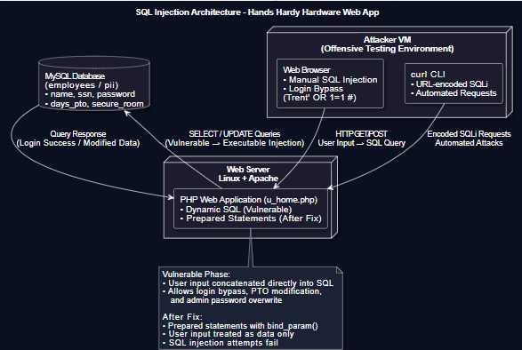
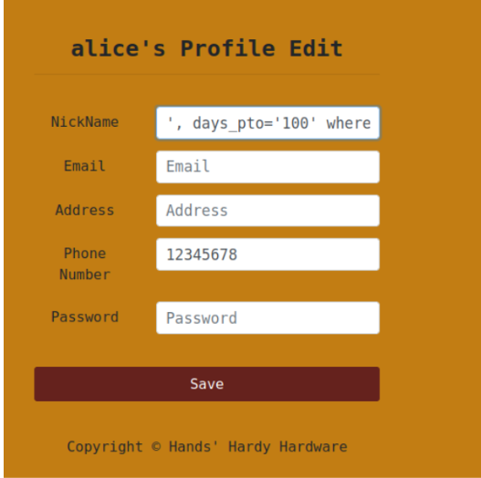

# SQL Injection Vulnerability Assessment: Authentication & Data Integrity

## Project Overview

This assessment evaluates the security posture of the "Hands Hardy Hardware" employee portal, specifically targeting the database interaction layer. The project successfully identified and exploited critical SQL Injection (SQLi) vulnerabilities leading to authentication bypass, unauthorized data manipulation, and administrative account takeover.

The engagement concluded with a white-box code review and the implementation of prepared statements to neutralize the identified threats.

  

## Technical Methodologies

* **Attack Vectors:** Boolean-based Blind SQLi, Tautology Injection, Inline Commenting.
* **Tools:** MySQL Command Line Client, Curl (Headless Automation), PHP Source Code Audit.
* **Vulnerability Classification:** CWE-89 (Improper Neutralization of Special Elements used in an SQL Command).

---

## Phase 1: Reconnaissance & Schema Enumeration

The assessment began with database mapping to identify high-value targets. [cite_start]By injecting queries into the application's input fields, the internal database structure was exposed using the `information_schema` table [cite: 94-96].

**Findings:**
* Target Database: `employees`
* Critical Table: `pii` (Personally Identifiable Information).
* [cite_start]Exposed Columns: `ssn`, `salary`, `password`, `days_pto` [cite: 127-128].

  

Figure 1: Enumerating table and column names via SQL injection.

---

## Phase 2: Authentication Bypass

### Web-Based Exploitation
The application's login mechanism was bypassed using a tautology attack. The payload `Trent' OR 1=1 #` was injected into the username field.
* [cite_start]**Mechanism:** The single quote closed the string literal, `OR 1=1` forced the query to evaluate as true, and the hash `#` commented out the remaining password verification logic [cite: 152-154].

  

Figure 2: Successful login as user "Trent" without valid credentials.

### Automated Exploitation
To validate the scalability of the vulnerability, the attack was replicated using `curl`. [cite_start]The payload was URL-encoded (`%27` for `'`, `%20` for space, `%23` for `#`) to successfully authenticate via the command line, demonstrating susceptibility to automated scanning tools [cite: 168-176].

  

Figure 3: Headless authentication bypass using URL-encoded payloads.

---

## Phase 3: Privilege Escalation & Data Integrity Compromise

Upon gaining access as a standard user ("Alice"), vulnerabilities in the "Edit Profile" function were exploited to manipulate database records belonging to other users.

### Unauthorized PTO Manipulation
An `UPDATE` injection was executed to arbitrarily increase vacation time. [cite_start]The payload `Alice', days_pto='100' where name='alice';#` was injected into the nickname field, successfully modifying the `days_pto` column [cite: 226-234].

The attack was further escalated to target other users. [cite_start]By modifying the `WHERE` clause to `WHERE name='hands'`, the attacker successfully reset the administrator's leave balance to zero, causing a Denial of Service (DoS) condition for that account [cite: 264-281].

  

Figure 4: Injection of the malicious UPDATE payload.

  

Figure 5: Database confirmation of altered PTO records.

### Account Takeover via Hash Injection
The most critical exploit involved overwriting the administrator's password. [cite_start]A pre-calculated SHA-1 hash (`40bd00...`, representing the string "123") was injected into the `Password` column for the user "Hands" [cite: 304-316]. This allowed the attacker to log in as the administrator using a known password.

  

Figure 6: Overwriting the administrator password hash.

---

## Phase 4: Code Analysis & Remediation

### Root Cause Analysis
A review of the `u_home.php` source code revealed that user input (`$input_uname`) was concatenated directly into the SQL query string without validation or escaping. [cite_start]This allows interpreted execution of malicious SQL commands [cite: 384-386].

  

Figure 7: Legacy code utilizing insecure string concatenation.

### Remediation Implementation
The vulnerability was mitigated by refactoring the backend to use **Prepared Statements**.
* **Logic:** The database query structure is compiled on the server before data binding occurs.
* [cite_start]**Implementation:** The `bind_param()` method was utilized to treat user input strictly as string data, preventing the SQL interpreter from executing injected commands [cite: 390-392].

  

Figure 8: Implementation of Prepared Statements to neutralize SQLi.

---

## Conclusion

This penetration test demonstrated how a single vulnerability class—SQL Injection—can cascade into a total system compromise, allowing for authentication bypass, unauthorized data modification, and administrative account takeover.

By moving beyond exploitation to perform root cause analysis and code remediation, the project highlights the critical importance of defensive programming. The successful transition from dynamic SQL to prepared statements serves as a definitive proof-of-concept for mitigating injection risks within the Software Development Life Cycle (SDLC).
